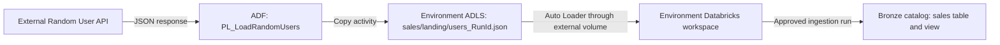

# ADF and Databricks promotion PoC

Start with the [architecture and promotion overview](docs/DATA_PLATFORM_ARCHITECTURE_AND_PROMOTION.md). For setup and operations, see the [ADF promotion guide](docs/ADF_PROMOTION_GUIDE.md) and [Databricks promotion guide](docs/DATABRICKS_PROMOTION_GUIDE.md).

Repository naming: environment workflows use `<action>-<platform>-<environment>.yml` (for example, `promote-adf-qa.yml`); PR checks use `validate-<platform>.yml`; committed ARM values use `<platform>-<environment>.parameters.json`. Databricks Python and resource files use `snake_case`. ADF artifact names and the required `databricks.yml` filename retain their platform conventions.

The DEV factory `dev-cgpc-poc` is connected to this repository on collaboration branch `Dev` with ADF root `/adf`. Its publish branch is `adf_publish`. Only DEV uses ADF Git integration; downstream factories receive reviewed source through deployments as their workflows are added. The intended Git promotion path is feature branch → `Dev` → `QA` → `Prod`, with a protected branch and PR review at every merge. Configure those branch rules in GitHub; the current deployment workflow implements the `QA` step.

The example pipeline `PL_LoadRandomUsers` copies the complete JSON response from `https://randomuser.me/api/?results=1000&exc=login` to a unique `sales/landing/users_<ADF RunId>.json` file for each run. Databricks later parses the `results` array. ADF pipeline, dataset, and linked service names remain the same in every factory.

## Data architecture



DEV and QA use the same ADF artifact names, but **separate Databricks workspaces**, catalogs, storage paths, and ingestion checkpoints. The QA storage URL and filesystem are supplied during ADF deployment. ADF-only changes trigger the ADF workflow; Databricks-only changes trigger the Databricks workflow. Deployment workflows create or update definitions; they do not run ADF pipelines or Databricks jobs.

## Environment configuration

ADF's [custom ARM parameter definition](adf/arm-template-parameters-definition.json) exposes the URL of each `AzureBlobFS` linked service and the filesystem of each dataset that has one. The `-` action removes the DEV value as an ARM default, so the deployment needs an explicit target value. For the current source, Microsoft's export generates `LS_AdlsGen2_url` and `DS_RandomUserLanding_fileSystem` as required parameters. The QA values are in [deploy/adf-qa.parameters.json](deploy/adf-qa.parameters.json); the target `factoryName` comes from the GitHub `qa` environment variable. The workflow never rewrites the exported template.

`deploy/adf-qa.parameters.json` is the committed, nonsecret **QA input** for the ADF ARM deployment. The workflow checks it against the exported template and adds the QA factory name to generate `build/adf/adf-qa.parameters.json` for that run. The generated file is ignored by Git. Databricks uses bundle targets and GitHub environment variables instead of this ARM parameter file.

| GitHub `qa` environment variable | Value |
| --- | --- |
| `DEV_FACTORY_RESOURCE_ID` | `/subscriptions/<subscription_id>/resourceGroups/<resource_group>/providers/Microsoft.DataFactory/factories/<dev_factory_name>` |
| `QA_ADF_RESOURCE_GROUP` | `<resource_group>` |
| `QA_ADF_FACTORY_NAME` | `<qa_factory_name>` |

Set `AZURE_CLIENT_ID`, `AZURE_TENANT_ID`, and `AZURE_SUBSCRIPTION_ID` as GitHub `qa` environment secrets. Configure the GitHub federated credential in Microsoft Entra ID for the ADF deployment identity, and grant it permission to deploy ADF child resources in the configured resource group. Databricks uses a separate federation policy on its own service principal in the Databricks account console; see the Databricks guide. The QA factory must already exist. Restrict the `qa` GitHub environment and protect the `QA` branch as appropriate for the PR review process.

Both factories' `LS_AdlsGen2` linked services use their respective factory managed identities. Grant each factory identity data-plane write access to its own storage destination (for example, Storage Blob Data Contributor) and verify any storage firewall and ADLS ACL settings before *running* a pipeline. Deployment itself does not run or inspect a pipeline. The existing QA storage account was previously reported as lacking hierarchical namespace; check its storage configuration when preparing an end-to-end ADLS Gen2 runtime test.

## QA deployment

For a short map of the workflow steps and connected files, see the [QA workflow guide](docs/PROMOTE_ADF_QA_WORKFLOW.md).

When reviewed ADF changes land on `QA`, [the workflow](.github/workflows/promote-adf-qa.yml) exports all ADF source with Microsoft's ADF utility, validates the environment configuration, then runs ARM validation and incremental deployment against the configured QA factory. An incremental deployment updates the resources included in the full export; it does not delete resources omitted from the export. A manual dispatch from `QA` can redeploy the reviewed state after an accidental change in the QA factory. The workflow can be dispatched manually once available on GitHub's default branch.

[scripts/prepare_adf_parameters.py](scripts/prepare_adf_parameters.py) checks that QA configuration names match the actual export and that every required parameter has a QA value. It adds `factoryName` to a temporary effective parameter file. It also rejects a source linked service with `encryptedCredential`, which ADF encrypts for one factory and cannot promote as-is. This is a validation guard, not credential stripping. The exported ARM template is passed to Azure unchanged.

When adding a linked service, dataset, or pipeline in DEV, use stable logical names. Add any new environment-specific properties to the ADF parameter definition, then add the generated QA parameter names and values to `deploy/adf-qa.parameters.json`. The workflow will fail clearly if a new required parameter has no QA value. Never commit secret values to the parameter file; use an Azure Key Vault reference or protected environment secret for those properties. Add Prod workflows and configuration when that target factory is ready, using the same export and parameter preparation approach.

## Inspect the generated artifacts locally

From the repository root, with Node.js and Python installed:

```bash
python3 scripts/test_adf_source.py
cd ci/adf
npm install --no-audit --no-fund
npm run build -- export ../../adf "/subscriptions/<subscription_id>/resourceGroups/<resource_group>/providers/Microsoft.DataFactory/factories/<dev_factory_name>" ../../build/adf
cd ../..
python3 scripts/prepare_adf_parameters.py \
  --source-root adf \
  --template build/adf/ARMTemplateForFactory.json \
  --configuration deploy/adf-qa.parameters.json \
  --factory-name "<qa_factory_name>" \
  --output build/adf/adf-qa.parameters.json
```

Inspect `build/adf/ARMTemplateForFactory.json` and `build/adf/adf-qa.parameters.json`. `build/` is ignored by Git because these files are generated for each deployment. `ARMTemplateParametersForFactory.json`, also created by the ADF utility, contains DEV export values and is **not** the parameter file passed to the QA deployment.
