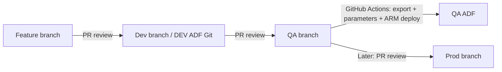

# ADF promotion guide: DEV to QA

## Executive summary

This repository stores Azure Data Factory (ADF) definitions in Git. Developers author and test them in the DEV factory. Reviewed changes move through protected branches: feature → `Dev` → `QA` → `Prod`. Only DEV is connected to Git in ADF Studio. Each downstream factory receives an ARM deployment after its promotion PR is merged. The repository currently implements **DEV to QA**; Prod is a future stage. There is no UAT environment.

The QA GitHub Actions workflow runs when ADF-related files change on `QA`. It exports the ADF definitions from the reviewed commit, supplies QA-specific values through an ARM parameter file, validates the deployment, and deploys all resources in the export to the existing QA factory. It does **not** execute ADF pipelines, inspect output files, or deploy Databricks. A successful deployment confirms that ADF resources were created or updated; runtime access to storage requires separate verification.



Keep the logical ADF names, such as `PL_LoadRandomUsers`, `DS_RandomUserLanding`, and `LS_AdlsGen2`, the same in every environment. Supply connection values separately for each environment. The pipeline copies the complete Random User API JSON response to an immutable `sales/landing/users_<ADF RunId>.json` file; it does not flatten the `results` array. See the [Databricks promotion guide](DATABRICKS_PROMOTION_GUIDE.md) for downstream processing in separate DEV and QA workspaces.

## 1. Prepare the QA Azure resources

1. Create or identify a QA Data Factory and a QA storage account in the intended subscription and resource group. The workflow deploys **inside an existing factory**; it does not create the factory or storage account.
2. If the dataset uses the `AzureBlobFS` linked service, verify that the storage account is suitable for ADLS Gen2, including hierarchical namespace. Create the target filesystem, for example `<qa_filesystem>`. A storage account without hierarchical namespace caused an earlier file check to fail and needs attention before an ADLS Gen2 runtime test.
3. Enable the QA Data Factory's system-assigned managed identity. This is the identity the ADLS linked service uses when the pipeline runs. Record the factory identity's principal ID for the later data-access role assignment.
4. Confirm that storage networking permits access from the integration runtime. Keep the QA ADLS endpoint and filesystem ready for `deploy/adf-qa.parameters.json`.

Example values, with placeholders:

```text
Subscription:     <subscription_id>
Resource group:   <resource_group>
QA factory:       <qa_factory_name>
QA ADLS account:  <qa_storage_account>
QA filesystem:    <qa_filesystem>
QA ADLS URL:      https://<qa_storage_account>.dfs.core.windows.net/
```

## 2. Create the GitHub-to-Azure OIDC trust

This identity is used by **GitHub Actions to deploy ADF resources**. It is separate from the QA factory's managed identity used to access storage at runtime.

1. In Microsoft Entra ID, create or select an app registration for the QA deployment. Copy its **Application (client) ID** and **Directory (tenant) ID**. Use the intended Azure subscription ID for the workflow.
2. In the app registration, open **Certificates & secrets → Federated credentials → Add credential**. Choose the **GitHub Actions deploying Azure resources** scenario, set the entity type to **Environment**, and enter the repository owner `<github_owner>`, repository `<github_repository>`, and environment name `qa`. If the portal asks for GitHub organization and repository numeric IDs, obtain the IDs for that exact repository and enter them; review the subject identifier generated by the portal rather than guessing it.
3. Keep the issuer `https://token.actions.githubusercontent.com` and audience `api://AzureADTokenExchange` for Azure public cloud, unless your cloud or security configuration explicitly uses different values. Give the credential a descriptive name such as `github-qa-deploy` and save it.
4. Ensure the GitHub workflow's job references `environment: qa` and has `id-token: write`. Both are already present in `.github/workflows/promote-adf-qa.yml`. The environment name and federated credential subject must match exactly.

OIDC avoids a long-lived Azure client secret in GitHub. The three IDs stored as GitHub environment secrets identify the app, tenant, and subscription; they are not an app password. This Entra credential is for ADF deployment only. The Databricks workflow uses a separate federation policy on a Databricks service principal; do not try to add a second Entra credential with the same GitHub issuer and subject for Databricks.

## 3. Grant the two identities their separate permissions

| Identity | Purpose | Suggested scope and access |
| --- | --- | --- |
| Entra app/service principal from step 2 | GitHub Actions deploys ADF resources | Assign **Data Factory Contributor** at `<resource_group>` or another suitable least-privilege scope that includes the QA factory. Verify it can validate and create a resource-group ARM deployment. |
| QA Data Factory system-assigned managed identity | Pipeline writes to QA ADLS | Grant **Storage Blob Data Contributor** on the QA storage destination, or appropriate ADLS ACLs including execute access to parent paths and write access to the sink. |

The workflow's Azure login does not give the Data Factory runtime access to storage. Likewise, granting storage access to the factory does not authorize GitHub Actions to deploy. Use the Azure portal's **Access control (IAM)** on the appropriate resource to make and verify each assignment. Role propagation can take time.

## 4. Configure GitHub and promote a reviewed commit

1. In the repository, open **Settings → Environments** and create an environment named exactly `qa`. Limit deployment branches to `QA`. Add required reviewers if your GitHub plan supports them and your team wants a separate deployment approval.
2. Add these **environment variables** under `qa`:

   | Name | Placeholder value |
   | --- | --- |
   | `DEV_FACTORY_RESOURCE_ID` | `/subscriptions/<subscription_id>/resourceGroups/<resource_group>/providers/Microsoft.DataFactory/factories/<dev_factory_name>` |
   | `QA_ADF_RESOURCE_GROUP` | `<resource_group>` |
   | `QA_ADF_FACTORY_NAME` | `<qa_factory_name>` |

3. Add these **environment secrets** under `qa`: `AZURE_CLIENT_ID` = `<application_client_id>`, `AZURE_TENANT_ID` = `<tenant_id>`, and `AZURE_SUBSCRIPTION_ID` = `<subscription_id>`. The workflow uses them with `azure/login@v2`. Do not add a client secret; this workflow uses OIDC.
4. In GitHub branch rules or rulesets, require PR reviews for `Dev` and `QA`, and for `Prod` when that branch is introduced. Open and merge a PR from the feature branch into `Dev`; then open and merge a PR from `Dev` into `QA`. A `QA` merge that changes ADF source, its parameters, or its workflow starts the ADF deployment automatically. Inspect the **Actions** run and the QA factory's resources. No manual pipeline run is part of this deployment.

The workflow also supports **Run workflow** on the `QA` ref after GitHub recognizes the workflow on the repository's default branch. Use this to redeploy the reviewed `QA` state if someone accidentally changes or deletes a deployed ADF resource. A dispatch from another ref is skipped by the job's branch guard.

## Deployment files and their roles

| File or directory | Role |
| --- | --- |
| [`adf/pipeline/`](../adf/pipeline/) | Versioned pipeline definitions. The current example is `PL_LoadRandomUsers.json`. |
| [`adf/dataset/`](../adf/dataset/) | Versioned source and landing dataset definitions. The landing dataset's filesystem becomes an ARM parameter. |
| [`adf/linkedService/`](../adf/linkedService/) | Versioned connection definitions. `LS_AdlsGen2` uses the factory's managed identity and has a URL that changes by environment. `LS_RandomUserHttp` points to the public source API. |
| [`adf/factory/`](../adf/factory/) | DEV factory source metadata consumed by the ADF export utility. The target factory name is supplied separately during deployment. |
| [`adf/arm-template-parameters-definition.json`](../adf/arm-template-parameters-definition.json) | ADF's custom parameter rules. They expose each `AzureBlobFS` URL and dataset filesystem as required parameters, without retaining DEV values as defaults. Add rules here when another property must vary by environment. |
| [`adf/publish_config.json`](../adf/publish_config.json) | ADF Studio's publish configuration for DEV. The QA workflow exports reviewed source directly; it does not deploy from `adf_publish`. |
| [`ci/adf/package.json`](../ci/adf/package.json) | Installs Microsoft's ADF utility. Its `export` command validates all ADF resources and generates the ARM template. |
| [`deploy/adf-qa.parameters.json`](../deploy/adf-qa.parameters.json) | Committed, nonsecret QA values for the exported ADLS URL and filesystem. `factoryName` is deliberately absent because the workflow supplies it from the GitHub `qa` environment. |
| [`scripts/prepare_adf_parameters.py`](../scripts/prepare_adf_parameters.py) | Checks that QA parameter names exist in the actual export and all required parameters have values; writes an effective QA parameter file. It rejects factory-bound `encryptedCredential` in linked-service source. It does not modify the ARM template or strip credentials. |
| [`scripts/test_adf_source.py`](../scripts/test_adf_source.py) | Tests generic parameter coverage, unchanged template resources, the encrypted-credential guard, and the immutable landing filename. The ADF validation and promotion workflows run it. |
| [`.github/workflows/validate-adf.yml`](../.github/workflows/validate-adf.yml) | Runs ADF source checks on promotion PRs without Azure credentials. |
| [`.github/workflows/promote-adf-qa.yml`](../.github/workflows/promote-adf-qa.yml) | Trigger, OIDC login, ADF export, parameter preparation, ARM validation, and incremental QA deployment. |
| [`.gitignore`](../.gitignore) | Excludes generated `build/` files, installed Node packages, and Python cache files from commits. |

The workflow generates `build/adf/ARMTemplateForFactory.json` plus `build/adf/adf-qa.parameters.json`. The first is the **unmodified ADF export**; the second supplies QA values and the QA factory name. Those are the two files passed to `az deployment group validate` and `az deployment group create`. The utility also creates `ARMTemplateParametersForFactory.json`, which reflects DEV export values and is **not** used for QA. `build/` is ignored by Git.

The naming pattern is `<action>-<platform>-<environment>.yml` for environment-specific workflows and `<platform>-<environment>.parameters.json` for committed ARM values. Thus `promote-adf-qa.yml` uses `deploy/adf-qa.parameters.json`; `promote-databricks-qa.yml` uses bundle target `qa` and GitHub environment variables, not an ARM parameter file. `validate-adf.yml` and `validate-databricks.yml` have no environment suffix because each validates PRs for multiple targets within its own platform.

## Adding another environment

Keep the same versioned ADF pipelines, datasets, linked services, parameter-definition rules, and Python preparation script. For Prod, add `deploy/adf-prod.parameters.json` with the Prod ADLS URL and filesystem, then add a Prod promotion workflow that passes this file and the Prod factory name to the existing export/validation/deployment steps. Configure a protected `prod` GitHub environment with its own factory settings, Azure OIDC federation, deployment permissions, and Data Factory managed-identity storage access. The Prod factory and ADLS destination must exist first. **A parameter file alone cannot start or authorize a Prod deployment.**

## What happens when ADF changes?

- A new pipeline or dataset is added to the exported ARM template and included in the next QA deployment. Existing resources in that export are also submitted to ARM; this workflow is a full-source, incremental deployment rather than a per-file patch. Resources omitted from an incremental ARM deployment are not deleted.
- A new environment-specific connection property needs a rule in `arm-template-parameters-definition.json` and a QA value in `deploy/adf-qa.parameters.json`. If the export introduces a required parameter without a QA value, the preparation script fails before Azure deployment.
- Keep logical ADF artifact names stable across environments. Keep secrets out of committed parameter files; use a managed identity, Key Vault reference, or protected secret mechanism appropriate for the connector.
- ADF definitions are separate from execution. Check runtime permissions and run a deliberate functional test after deployment when the team is ready. This PoC workflow intentionally has no automatic pipeline run or landing-file check.

## Next steps and recommendations

1. Confirm that QA storage has hierarchical namespace and that the configured filesystem exists. Confirm QA Data Factory managed identity access before the first runtime test.
2. Protect the promotion branches and review the feature → `Dev` → `QA` PRs. Verify that the QA GitHub environment, OIDC credential, and deployment role are configured before merging to `QA`.
3. After the workflow succeeds, inspect the QA factory's pipeline, datasets, and linked services. Test the linked service and run the pipeline separately when runtime validation is desired.
4. Add Prod configuration, a GitHub environment, federated credentials, and workflows when the Prod factory is ready. Keep the same ADF names and apply the same export-and-parameter pattern at each stage.
5. Before scaling further, pin the ADF utility version and commit a package lockfile for repeatable CI builds. Add a release or version tag to identify exactly which reviewed commit reached each environment. If triggers or private endpoints are introduced, review ADF's specific pre/post-deployment and resource limitations before adding them to the workflow.

## References

- [Microsoft: ADF CI/CD guidance](https://learn.microsoft.com/en-us/azure/data-factory/continuous-integration-delivery)
- [Microsoft: ADF automated publish utility](https://learn.microsoft.com/en-us/azure/data-factory/continuous-integration-delivery-improvements)
- [Microsoft: custom ARM parameters for ADF](https://learn.microsoft.com/en-us/azure/data-factory/continuous-integration-delivery-resource-manager-custom-parameters)
- [Microsoft: GitHub Actions OIDC for Azure](https://learn.microsoft.com/en-us/azure/developer/github/connect-from-azure-openid-connect)
- [Microsoft: ADLS Gen2 linked-service permissions](https://learn.microsoft.com/en-us/azure/data-factory/connector-azure-data-lake-storage)
- [GitHub: environments and deployment protection](https://docs.github.com/en/actions/reference/workflows-and-actions/deployments-and-environments)
