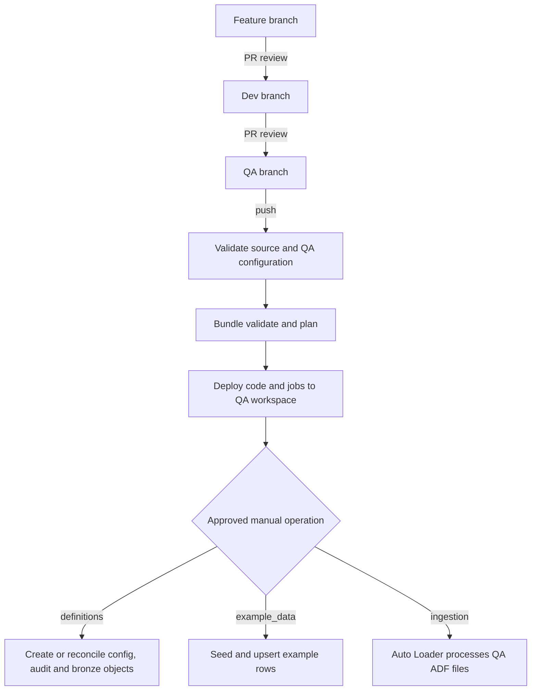

# Databricks promotion: DEV to QA

## Executive summary

The repository holds Databricks job definitions, notebooks, and Unity Catalog table definitions. DEV and QA are **different Databricks workspaces**. A reviewed merge to `QA` validates and deploys a Databricks bundle to the QA workspace; deployment does **not** run a job. A separate approved GitHub Actions dispatch applies definitions, example rows, or ingestion when the team is ready.

The same bundle can deploy to DEV with the `dev` target, using DEV workspace settings. Later UAT and Prod targets follow the protected branch promotion sequence once their workspaces, catalogs, and access are defined.

## Environment boundaries and one-time setup

| Target | Workspace | Platform catalog | Bronze catalog |
| --- | --- | --- | --- |
| DEV | `<dev_databricks_workspace_url>` | `dev_scratch_ca` | `dev_bronze_ca` |
| QA | `<qa_databricks_workspace_url>` | `edp_qa` | `qa_bronze_ca` |

The two workspace URLs **must differ**. The QA workspace needs a Databricks service principal for GitHub deployment and job runs. Configure GitHub OIDC federation for repository `<owner>/<repo>` and GitHub environment `qa`, grant that principal workspace access, job management rights, `USE CATALOG` and `CREATE SCHEMA` on the QA catalogs, and appropriate permissions on the target schemas/tables. Databricks OIDC is separate from the Azure OIDC identity used by the ADF workflow. Use [Databricks' GitHub OIDC setup](https://learn.microsoft.com/en-us/azure/databricks/dev-tools/auth/provider-github); do not put a personal access token in GitHub.

Create or verify the QA catalogs through the platform governance process. Ensure a `sales` schema and an **external volume** in `qa_bronze_ca.sales` exposing only QA ADF landing files. Provision a different **managed volume** for Auto Loader checkpoints. The QA Databricks job identity needs read access to the landing volume and write access to the checkpoint volume, bronze tables, and quarantine table. Check that the QA ADLS account supports hierarchical namespace and that storage credentials, external locations, firewall rules, and volume grants allow access. Catalogs, storage credentials, external locations, volumes, and grants are administrator-owned prerequisites; normal code promotion does not recreate them.

Create a protected GitHub environment named `qa`, restricted to the `QA` branch and with required reviewers for approved runs. Add these **GitHub environment variables** (placeholders indicate values the team must provide):

| Variable | Value |
| --- | --- |
| `DATABRICKS_HOST` | `https://<qa_workspace_host>` |
| `SOURCE_DATABRICKS_HOST` | `https://<dev_workspace_host>` for QA; rejects an accidental same-workspace deployment |
| `DATABRICKS_CLIENT_ID` | `<qa_databricks_service_principal_client_id>` |
| `DATABRICKS_LANDING_VOLUME_PATH` | `/Volumes/qa_bronze_ca/sales/<qa_landing_volume>` |
| `DATABRICKS_CHECKPOINT_PATH` | `/Volumes/qa_bronze_ca/sales/<qa_checkpoint_volume>/random_users` |

If an earlier setup used `DEV_DATABRICKS_HOST`, replace that GitHub variable with `SOURCE_DATABRICKS_HOST`. For QA its value is the DEV workspace host; later promotion stages use their own source workspace.

The workflow supplies these values to bundle variables, checks that hosts differ, and authenticates with `DATABRICKS_AUTH_TYPE=github-oidc`. The landing and checkpoint paths must be distinct. The external landing volume should map to the QA `sales/landing` directory produced by ADF; ADF now writes a new `users_<ADF RunId>.json` file each run. Auto Loader relies on immutable input files and a stable checkpoint.

## Promotion and operations

1. Open reviewed PRs from feature → `Dev` and then `Dev` → `QA`. Databricks PR validation checks Python syntax, YAML uniqueness, and target boundaries. ADF source has its own PR validation workflow.
2. The QA merge runs `promote-databricks-qa.yml` when Databricks files changed. It validates, plans, and deploys **job definitions and source** to the QA workspace. It does not create tables or ingest files.
3. After reviewing the deployment plan and prerequisites, run `apply-databricks-qa.yml` against the `QA` ref and choose **definitions**. This applies config/audit tables and bronze sales tables/view.
4. If desired, dispatch **example_data** separately. The example seed and upsert files are active YAML; the second operation updates the same example key in the selected environment. They are never part of the deployment itself.
5. Run the QA ADF pipeline when its storage connection is ready. Then dispatch **ingestion**. Auto Loader reads the QA external volume and persists its checkpoint in the QA managed volume. It inserts new users, updates changed users, and writes malformed or missing-email records to `sales.random_users_quarantine`.

**GitHub default-branch prerequisite:** This repository's default branch is `main`. GitHub only exposes a `workflow_dispatch` workflow after its workflow file exists on the default branch. Arrange a one-time reviewed addition of `apply-databricks-qa.yml` to `main`; then select the `QA` ref when manually running it. The job also rejects any non-`QA` ref. No branch is merged automatically by these files.

## File map

| Path | Purpose |
| --- | --- |
| `databricks/bundles/databricks.yml` | Bundle targets, catalog mapping, workspace host, and volume path variables. |
| `databricks/bundles/resources/jobs_data_platform.yml` | Three independent job resources: definitions, example data, ingestion. |
| `databricks/bundles/config/data_platform/` | Versioned config/audit schema definitions and explicit example rows, with no catalog override. |
| `databricks/src/schema_builder.py`, `apply_platform_tables.py` | Additive platform schema/table application; type drift fails and column deletion is disabled. |
| `databricks/src/apply_bronze_definitions.py`, `ingest_random_users.py` | Bronze table/view definitions and idempotent Auto Loader ingestion. |
| `databricks/src/target_guard.py`, `yaml_utils.py`, `workspace_paths.py` | Workspace/catalog guard, duplicate-key YAML validation, and explicit bundle path resolution. |
| `.github/workflows/promote-databricks-qa.yml` | QA deployment after merge, without a run. |
| `.github/workflows/apply-databricks-qa.yml` | QA-approved manual operation; one choice per dispatch. |
| `.github/workflows/validate-databricks.yml` | Read-only PR checks. |

## Review and recovery

Run `python scripts/test_databricks_source.py` locally after installing PyYAML. In GitHub, review the `bundle plan` output before accepting a deployment. If someone deletes a deployed job, manually dispatch the deploy workflow on `QA` to restore the reviewed bundle state. If a table is deleted, deploy alone will not recreate it: run the approved **definitions** operation, then restore data through the appropriate ingestion/recovery process. The bundle is configured for Databricks' direct deployment engine; if this bundle was previously deployed with Terraform state, migrate that state before its first direct deployment.

The PoC uses normalized email as an upsert key. That is not a durable person identifier; use a source-provided stable ID before a production user model. Ingestion does not infer deletions from absent API rows. DEV and QA keep separate checkpoints, so a QA run does not reuse DEV progress.

## Adding Prod

Reuse the same notebooks, YAML object definitions, and bundle job resources. Add a `prod` target in `databricks/bundles/databricks.yml` and its catalog pair in `databricks/src/target_guard.py`, then configure a separate Prod workspace host, OIDC service principal, volumes, checkpoint, grants, and protected GitHub `prod` environment. Set `SOURCE_DATABRICKS_HOST` to the UAT workspace host for the Prod promotion. Add environment-specific promotion and approved-apply workflow entry points for the `Prod` branch. The Prod workflow supplies bundle variables through the GitHub environment; there is **no Databricks ARM parameter file**. Keep the existing DEV and QA hosts and checkpoint paths separate from Prod. Future UAT and Prod workflows can call reusable workflows if the team wants to reduce repeated YAML.

References: [Databricks bundle workflow](https://learn.microsoft.com/en-us/azure/databricks/dev-tools/bundles/work-tasks), [direct engine and migration](https://learn.microsoft.com/en-us/azure/databricks/dev-tools/bundles/direct), [Auto Loader guidance](https://learn.microsoft.com/en-us/azure/databricks/ingestion/cloud-object-storage/auto-loader/best-practices), [streaming MERGE](https://learn.microsoft.com/en-us/azure/databricks/structured-streaming/delta-lake).
