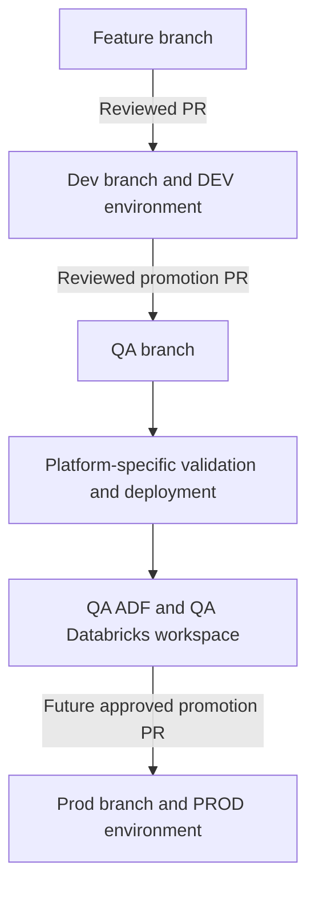
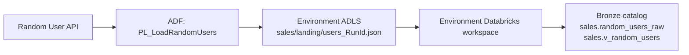
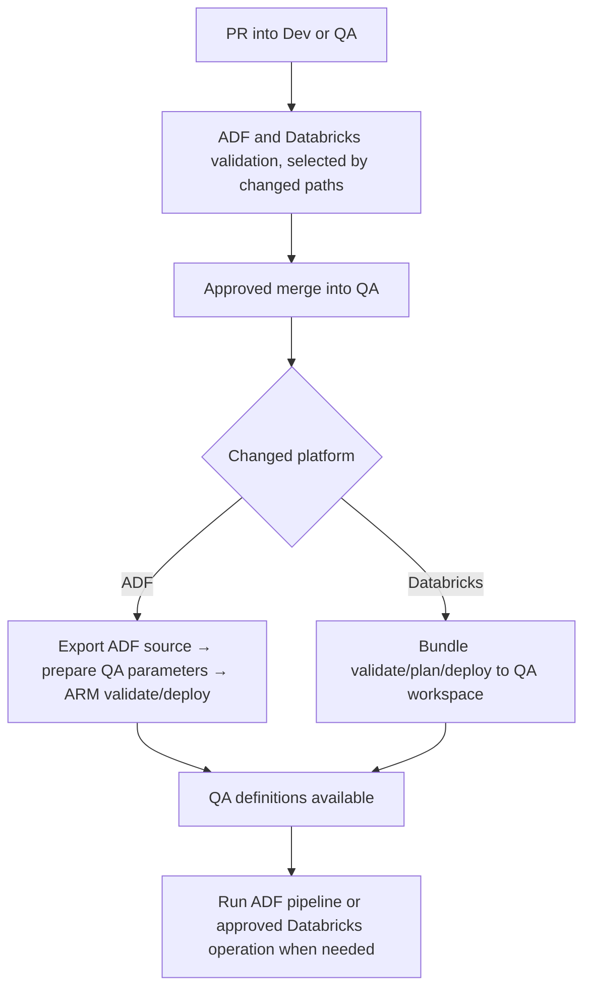

# CGPC data platform architecture and code promotion

## Executive summary

This document describes the CGPC project's **current DEV-to-QA proof of concept** and the intended path to PROD. One GitHub repository holds the deployable ADF and Databricks source. Changes move through reviewed pull requests from a feature branch to `Dev`, then `QA`, and eventually `Prod`. Only the DEV Data Factory is connected to Git; GitHub Actions deploys reviewed source to the other factories. DEV and QA use separate Databricks workspaces and environment-specific storage and catalogs.

The QA workflows **deploy definitions and code**. They do not run the ADF pipeline or Databricks ingestion automatically. Databricks data-object changes are applied through a separately approved manual workflow. There is **no UAT environment** in this design.



## 1. Scope and implementation status

| Area | Current PoC | Intended next stage |
| --- | --- | --- |
| Environments | DEV and QA | Add PROD; no UAT |
| Source ingestion | Random User API → ADF → ADLS | Add other sources using the same environment pattern |
| Databricks | Separate DEV and QA workspaces; Bronze sales objects and ingestion code | PROD workspace; additional data products and layers as needed |
| CI/CD | Separate ADF and Databricks QA workflows | PROD workflows and configuration |
| dbt and Airflow | Outside this PoC | Design and add only when required |

The workflows describe the desired deployments. A committed file or successful deployment does not, by itself, prove that an ADF pipeline has run, a landing file exists, or a Databricks table has been populated.

## 2. Runtime architecture

Each environment has its own ADF factory, ADLS destination, Databricks workspace, and Bronze catalog. The example data path is:



ADF copies the API's full JSON response into a uniquely named landing file. The Databricks ingestion job reads those files through a Unity Catalog volume, parses the `results` array, and writes Bronze data. A checkpoint belongs to the target environment so QA does not reuse DEV ingestion state. The pipeline and ingestion job run only when explicitly invoked.

| Environment | ADF | ADLS | Databricks | Bronze catalog |
| --- | --- | --- | --- | --- |
| DEV | Git-connected development factory | DEV storage destination | DEV workspace | `dev_bronze_ca` |
| QA | Deployed factory | QA storage destination | QA workspace | `qa_bronze_ca` |
| PROD | Future deployed factory | Future PROD destination | Future PROD workspace | To be agreed before implementation |

The PoC uses the `sales` business schema and the project catalog names `dev_bronze_ca` and `qa_bronze_ca`. Current platform configuration and audit objects use `dev_scratch_ca` in DEV and `edp_qa` in QA. These are separate from the Bronze catalogs.

### Unity Catalog governance

The proposed target is one regional metastore with environment-specific catalogs and workspace-catalog bindings, subject to the client's governance and regional requirements. Catalog creation, storage credentials, external locations, volumes, grants, and workspace bindings are platform prerequisites. The current CI/CD workflows do not provision or verify all of them. Confirm them in the actual DEV and QA accounts before claiming full environment isolation. The code checks the selected workspace host and catalog pair at runtime; those checks complement platform access controls.

## 3. Repository and ownership

```text
adf/                       ADF Studio source for the Git-connected DEV factory
ci/adf/                    ADF export utility
databricks/bundles/        Bundle targets, resources, and versioned configuration
databricks/src/            Databricks job and data-object code
deploy/                    Nonsecret ADF environment parameter files
scripts/                   Source and target validation helpers
.github/workflows/         Platform-specific validation, deployment, and apply workflows
docs/                      Operating guides and architecture
```

ADF Studio determines the source folder names under `adf/` (`pipeline`, `dataset`, and `linkedService`). ADF artifact names such as `PL_LoadRandomUsers`, `DS_RandomUserLanding`, and `LS_AdlsGen2` stay stable across factories. Environment-specific endpoints and filesystem values come from deployment configuration.

## 4. Promotion and deployment

The intended branch sequence is **feature → `Dev` → `QA` → `Prod`**, with reviewed pull requests at each promotion point. Branch protection and GitHub Environment approval rules must be configured in GitHub; their existence cannot be inferred from repository files. The current repository implements QA workflows, while the Prod stage remains future work.



### ADF promotion

`promote-adf-qa.yml` runs when relevant changes land on `QA` and can also be dispatched manually from that branch. It validates the ADF source, exports it as an ARM template using Microsoft's ADF utility, checks the QA input values, runs ARM validation, and deploys to the QA factory. The exported template is **not rewritten**. ADF's `arm-template-parameters-definition.json` exposes the ADLS linked-service URL and dataset filesystem. `deploy/adf-qa.parameters.json` supplies the QA values; the QA factory name comes from the GitHub `qa` environment. The generated effective ARM parameter file exists only in the build output.

The ARM deployment uses **Incremental** mode. It creates or updates resources present in the export; deleting an artifact from Git does not automatically remove a resource that already exists in QA. A manual workflow dispatch can redeploy the reviewed QA state after an accidental change in the factory. Deployment does not execute `PL_LoadRandomUsers`.

### Databricks promotion

`promote-databricks-qa.yml` validates the `qa` bundle target, shows a deployment plan, and deploys source and job definitions to the QA workspace. The bundle maps QA to `edp_qa` and `qa_bronze_ca`; GitHub `qa` environment variables supply the workspace URL and environment-specific volume paths. A target check rejects the DEV workspace host and unexpected volume paths.

`apply-databricks-qa.yml` is a separate manual workflow with three choices: **definitions** (create or reconcile config, audit, Bronze tables and view), **example_data** (seed/upsert PoC rows), or **ingestion** (process QA landing files). Bundle deployment alone does not apply these data-object operations or ingest data. Run them only after the QA prerequisites and intended operation have been reviewed. The workflow file must be available on the repository's default branch for GitHub's manual dispatch UI, while the run selects the `QA` ref.

### Environment configuration and identity

| Platform | QA configuration source | Authentication |
| --- | --- | --- |
| ADF | `deploy/adf-qa.parameters.json` plus GitHub `qa` environment values for factory and resource group | GitHub OIDC to Azure for deployment; factory managed identity for storage access at runtime |
| Databricks | `qa` bundle target plus GitHub `qa` environment variables for host and volume paths | GitHub OIDC to a Databricks service principal |

The Azure deployment identity and the Databricks deployment identity are different. Configure the ADF GitHub credential in Microsoft Entra ID and the Databricks GitHub federation policy on a Databricks service principal in the Databricks account console. The ADF credential cannot replace the Databricks policy. Neither workflow needs a credential embedded in source files. Give each identity only the access required for its target environment. Keep secret values in the appropriate identity platform or GitHub Environment, not in committed parameter files.

## 5. File map for the QA PoC

| File | Role |
| --- | --- |
| `adf/arm-template-parameters-definition.json` | Exposes environment-specific ADF properties during ARM export. |
| `deploy/adf-qa.parameters.json` | Committed, nonsecret QA ADF URL and filesystem inputs. |
| `scripts/prepare_adf_parameters.py` | Validates exported parameter names and prepares the effective QA parameter file. |
| `.github/workflows/validate-adf.yml` | ADF source checks on relevant PRs. |
| `.github/workflows/promote-adf-qa.yml` | Deploys reviewed ADF definitions to QA. |
| `databricks/bundles/databricks.yml` | DEV and QA targets, catalog pairs, and runtime variables. |
| `databricks/bundles/resources/jobs_data_platform.yml` | Definitions, example-data, and ingestion job definitions. |
| `databricks/src/target_guard.py` | Checks the environment's workspace host and catalog pair. |
| `.github/workflows/validate-databricks.yml` | Databricks source checks on relevant PRs. |
| `.github/workflows/promote-databricks-qa.yml` | Deploys the QA bundle without running jobs. |
| `.github/workflows/apply-databricks-qa.yml` | Runs one approved QA data operation on demand. |

For operating steps and prerequisites, see `docs/ADF_PROMOTION_GUIDE.md` and `docs/DATABRICKS_PROMOTION_GUIDE.md`.

## 6. Verification and recovery

- Review the PR checks and QA deployment logs separately. A successful deployment confirms definitions were accepted; it does not confirm a successful data run.
- Before a QA runtime test, confirm ADLS Gen2 hierarchical namespace, the `sales` filesystem, ADF managed-identity access, Unity Catalog volumes and grants, and a separate QA Databricks workspace.
- To restore accidentally changed ADF artifacts or Databricks jobs, dispatch the corresponding QA deployment workflow from the reviewed `QA` branch.
- To restore a deleted Databricks table or view, redeploying the bundle is insufficient: run the approved **definitions** operation, then restore or reingest data as appropriate. Do not assume a recreated table contains its previous rows.
- Treat production-like data provisioning as a separate, controlled process. The PoC uses a public synthetic API; a future client source may require masked or purpose-built test data in DEV and QA.

## 7. Next steps

1. Promote each reviewed change through `Dev` and `QA`, using the project's branch protections and PR checks.
2. Verify the live QA storage, Databricks workspace, catalogs, volumes, permissions, and workspace-catalog bindings. Record the result separately from code deployment status.
3. Run a controlled end-to-end QA test: ADF pipeline, landing-file check, Databricks definitions, then ingestion and row-level validation.
4. Before adding PROD, agree on its factory, storage, Databricks workspace, catalog names, access model, and release approval rules. Add a Prod ADF parameter file and deployment workflow, a Databricks `prod` target and target checks, and a protected GitHub `prod` environment. Reuse the same source logic.
5. Add Silver/Gold, dbt, or Airflow only when their ownership and runtime requirements are defined; keep each technology's validation and deployment workflow independently scoped.

This document describes the repository design and intended controls. Confirm GitHub protection rules and cloud resources in their respective services before reporting them as implemented.
