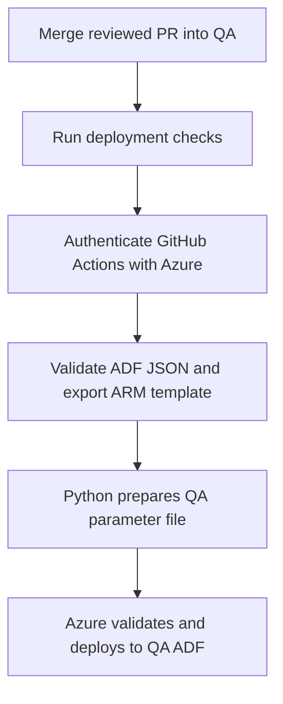
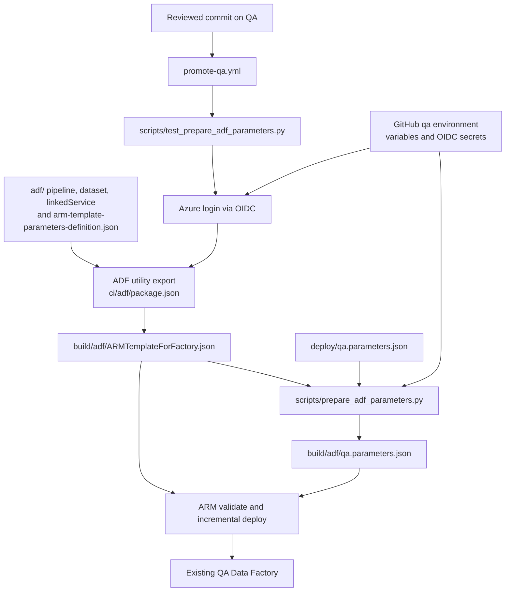

# QA ADF deployment workflow

## Executive summary

The [promote-qa.yml workflow](../.github/workflows/promote-qa.yml) deploys reviewed ADF definitions when a PR is merged into `QA`. It can also be started manually on the `QA` ref. Only the `QA` branch job runs, and its GitHub environment is `qa`.

## Steps

1. **Check out and test.** GitHub checks out the `QA` commit, installs Node.js and Python, runs the parameter-preparation tests, and checks that required `qa` environment settings exist. It refuses a target factory name equal to the DEV factory name.
2. **Authenticate.** `azure/login@v2` uses GitHub OIDC with `AZURE_CLIENT_ID`, `AZURE_TENANT_ID`, and `AZURE_SUBSCRIPTION_ID` from the `qa` environment. The Azure federated credential must trust this repository and its `qa` environment.
3. **Export ADF.** Microsoft's utility from [`ci/adf/package.json`](../ci/adf/package.json) validates the ADF source under [`adf/`](../adf/) and produces `build/adf/ARMTemplateForFactory.json`. The [ARM parameter definition](../adf/arm-template-parameters-definition.json) makes the ADLS URL and dataset filesystem environment-specific parameters.
4. **Prepare QA values.** [`scripts/prepare_adf_parameters.py`](../scripts/prepare_adf_parameters.py) checks the export against [`deploy/qa.parameters.json`](../deploy/qa.parameters.json), adds `QA_ADF_FACTORY_NAME` as `factoryName`, and writes `build/adf/qa.parameters.json`. It does not alter the exported template.
5. **Validate and deploy.** Azure CLI validates the template and performs an incremental deployment to the existing QA factory in `QA_ADF_RESOURCE_GROUP`. Both commands use the unchanged template and the effective QA parameter file.

The `build/` files are generated for each run and ignored by Git. The utility's `ARMTemplateParametersForFactory.json` contains DEV export values and is **not** passed to the QA deployment. The workflow does not run an ADF pipeline or verify an ADLS output file.

For initial Azure and GitHub setup, branch promotion, and runtime permissions, see the [full ADF promotion guide](ADF_PROMOTION_GUIDE.md).
